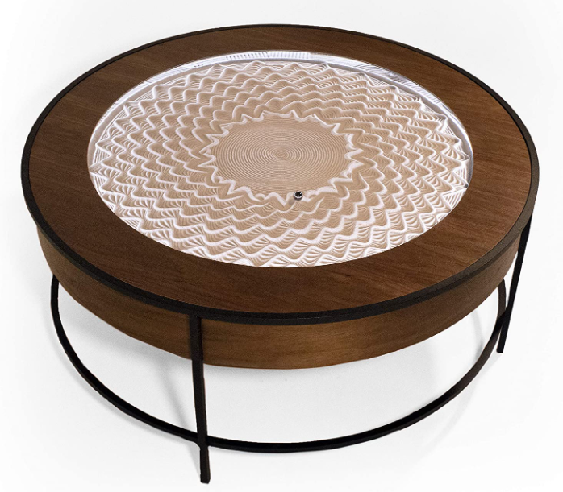
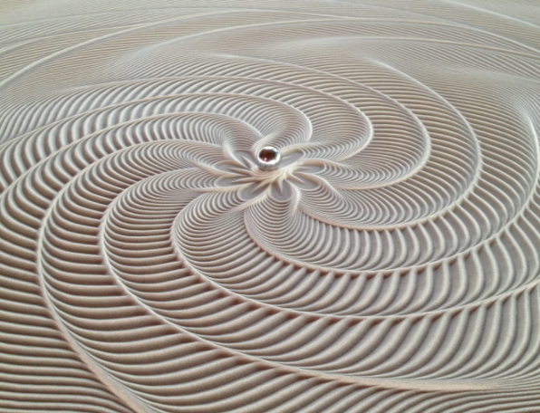
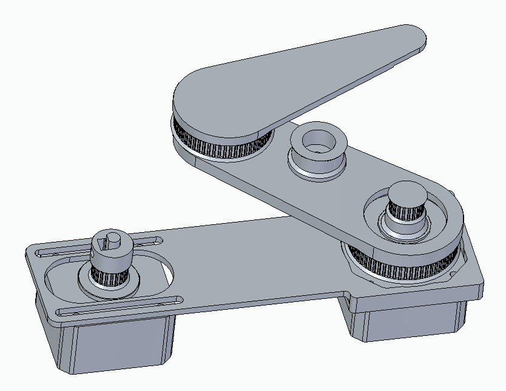
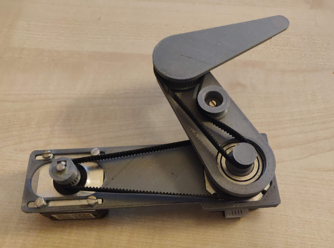
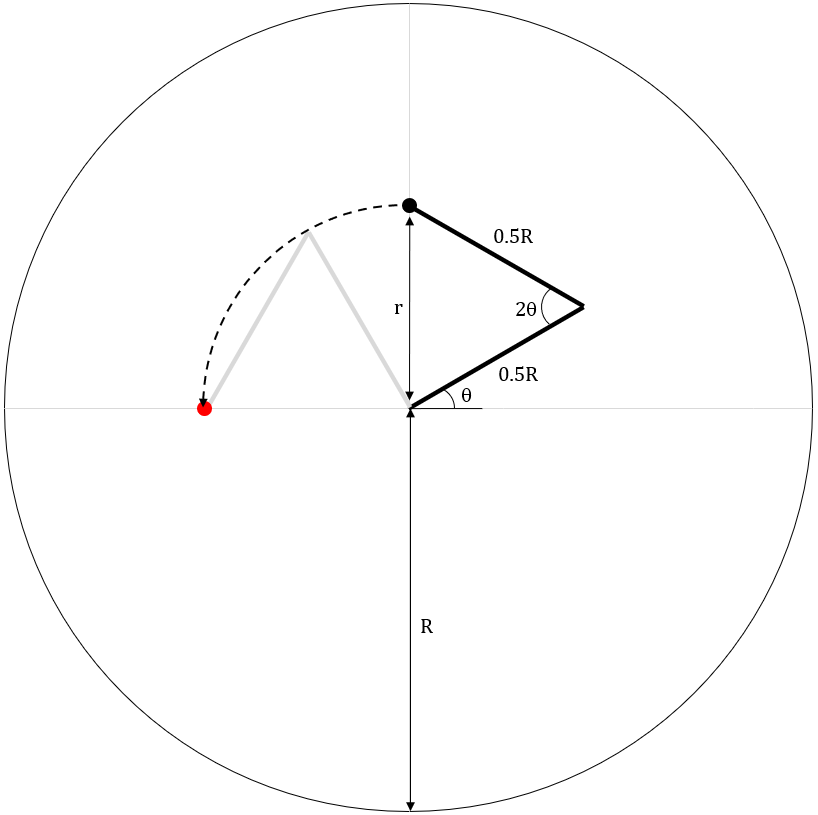

# Sisyphus Table Clone - WIP

My attempt to create a copy of the "Sisyphus Table" by Bruce Shapiro

To do:
1. Physical motion mechanism
2. Motion code
3. Final electronics/code
   - e.g. WiFi control, lighting
4. Casing

## Background

The Sisyphus Table is a kinetic art piece that uses a ball bearing to draw patterns in a bed of sand. The ball bearing is controlled by a motion mechanism underneath the table, and so it appears as if the ball is moving around on its own. My goal is to create one of these with the main aims being low cost and mainly 3D-printed parts. Mine will be a desktop sized version rather than a full table.

  

<em>
	Bruce Shapiro's Sisyphus Table
</em>

  

<em>
	Pattern Example
</em>

## Motion Mechanism

To move the ball bearing around, a magnet needs to move underneath the table. There are several ways to achieve this, and after some experimenting I have landed on a SCARA setup. This is compact and easily 3D printable, the only additional parts being some screws and timing belts. A stepper motor controls each arm.

  

<em>
	My CAD Model of the SCARA Assembly
</em>

  

<em>
	Printed and Assembled Parts
</em>

## Motion Logic

For a 2-armed robot moving in a circular area, the positions can be expressed as a polar coordinate, i.e. a given radius and angle, `(r,theta)`. `r` is a fraction of the maximum radius, i.e. a value between 0 and 1, and `theta` is the rotation about the centre. 

To move from one position to another, the motion can be split into two parts - moving from the first radius to the second, and then rotating from the first angle to the second. Each of these movements is easy to calculate on their own in terms of how many steps each arm's motor needs to move, and you can simply add these steps together for each movement to make them happen simultaneously. 

To get the arm to the `r` radius, both arms are essentially moved to the same but opposite "arm" angle. This creates an isosceles triangle, where the "arm" angle is calculated as `sin^-1(r)`. Once the end of the arm is the correct distance from the centre, both arms can be rotated together to get the requested angle. These two motions can be added together and be performed at the same time, although this will not necessarily result in a straight line motion. With a small enough resolution between points in a pattern however this shouldn't be a problem. 

  

<em>
	Figure Showing Movement Logic
</em>

- The theta in this image denotes the "arm" angle
- `R` denotes the maximum radius, and `r` denotes the requested position radius
- Clearly each arm has a length half of the maximum radius
- The theta is varied on both arms together to reach a certain `r`, and then both arms are rotated together as shown in the dashed line 
- For a requested `r` of 0.5, the theta in the image would therefore be 30 degrees
